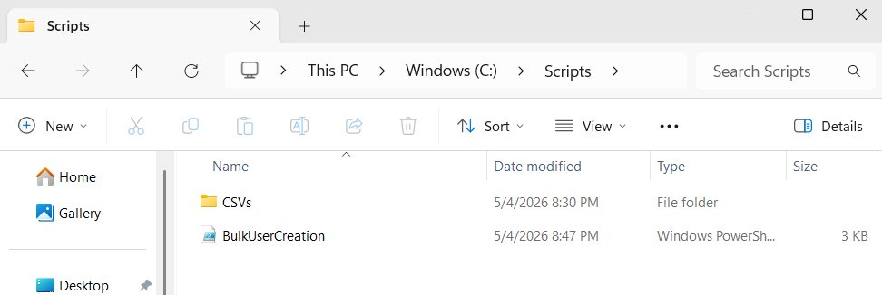
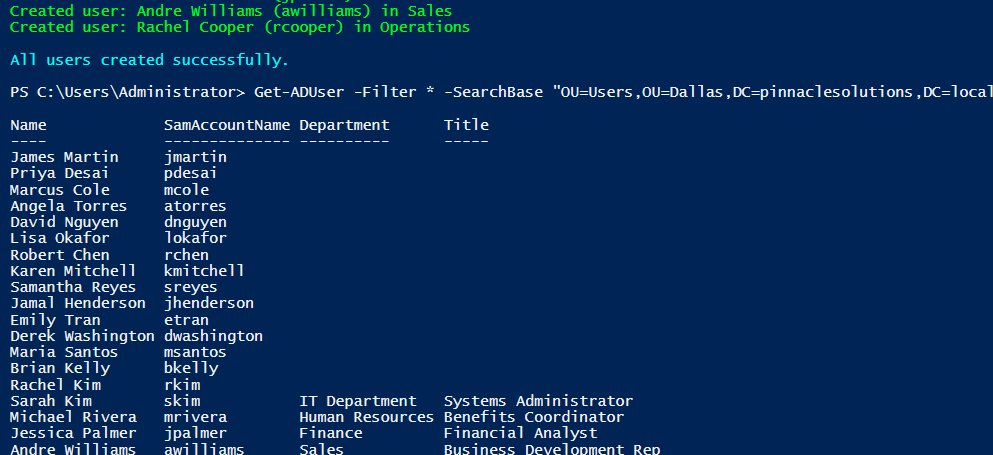
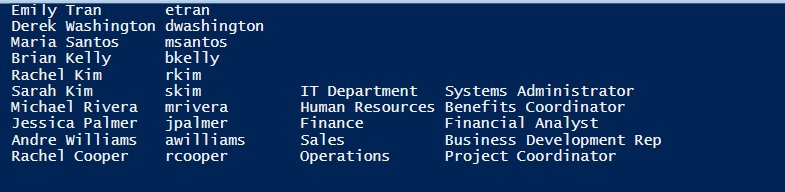
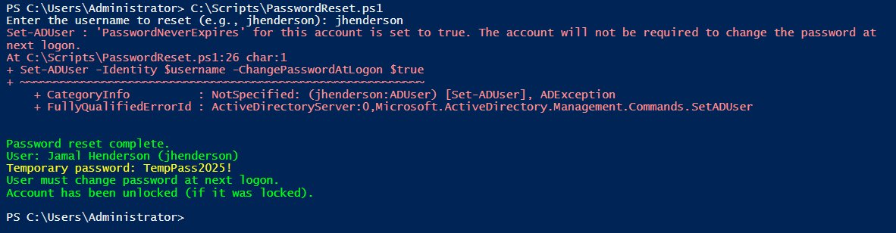
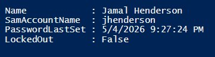
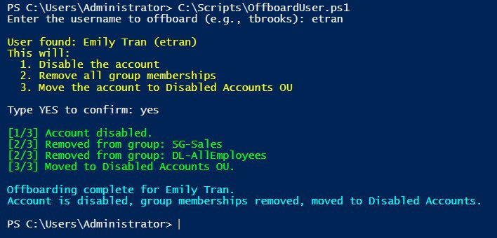
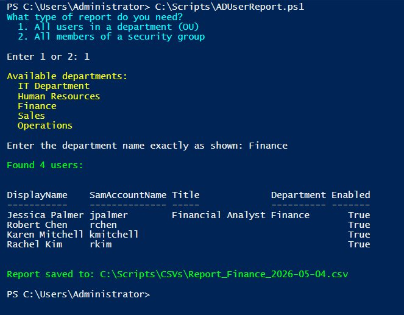
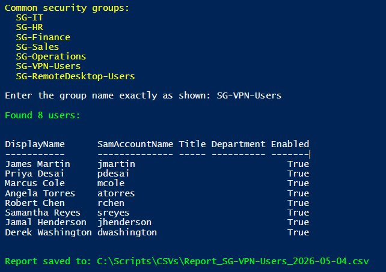
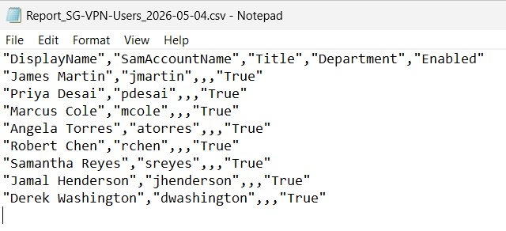

# PowerShell Scripting for Active Directory — Automating Help Desk Tasks

**Environment:** Windows Server 2022 Domain Controller · VMware Workstation · Domain: `pinnaclesolutions.local`  
**Builds on:** [Active Directory Home Lab](https://github.com/des-holbert/active-directory-homelab) · [Group Policy Objects](https://github.com/des-holbert/gpo-homelab)

In Project 1, I created 15 user accounts by hand through the Active Directory GUI. That's fine for learning how AD works. But on a real help desk, nobody creates users one click at a time when a batch of new hires starts on Monday.

This project takes the manual tasks from Project 1 and automates them with PowerShell. Each script maps to a real help desk task — the kind of thing you'd do multiple times a week. The story for interviews: "I created users manually to learn the process, then wrote PowerShell scripts to automate it."

**Status:** Scripts 1–4 complete. Scripts 5–6 in progress.

---

## Project Structure

```
powershell-ad-automation/
├── scripts/
│   ├── BulkUserCreation.ps1
│   ├── PasswordReset.ps1
│   ├── OffboardUser.ps1
│   └── ADUserReport.ps1
├── csv/
│   └── NewHires.csv
├── screenshots/
└── README.md
```



---

## Core PowerShell Commands Used

These 10 commands cover almost everything in this project:

| Command | What It Does |
|---|---|
| `New-ADUser` | Creates a user account |
| `Set-ADUser` | Modifies a user account |
| `Get-ADUser` | Pulls info about a user |
| `Add-ADGroupMember` | Adds someone to a group |
| `Remove-ADGroupMember` | Removes someone from a group |
| `Disable-ADAccount` | Disables an account |
| `Set-ADAccountPassword` | Resets a password |
| `Search-ADAccount` | Finds locked/disabled/expired accounts |
| `Import-Csv` | Reads a CSV file |
| `Export-Csv` | Writes data to a CSV file |

---

## Script 1: Bulk User Creation from CSV

**File:** `scripts/BulkUserCreation.ps1`  
**The scenario:** HR sends a list of 5 new hires starting Monday. Instead of creating each account by hand, the script reads a CSV file and creates every account automatically — right OU, right security groups, right naming convention.

### How It Works

The CSV file has one row per new hire:

```
FirstName,LastName,Department,Title,Password
Sarah,Kim,IT Department,Systems Administrator,Welcome2025!
Michael,Rivera,Human Resources,Benefits Coordinator,Welcome2025!
Jessica,Palmer,Finance,Financial Analyst,Welcome2025!
Andre,Williams,Sales,Business Development Rep,Welcome2025!
Rachel,Cooper,Operations,Project Coordinator,Welcome2025!
```

The script reads the CSV with `Import-Csv`, which turns each row into an object. A `foreach` loop processes each person:

1. Builds the username using the company naming convention — first initial + last name, lowercase (Sarah Kim → `skim`)
2. Constructs the OU path so the account lands in the correct department under `Dallas > Users > [Department]`
3. Converts the temporary password to a secure string (required by PowerShell)
4. Creates the account with `New-ADUser` — display name, title, department, UPN, all populated
5. Maps the department to the matching security group using a `switch` block
6. Adds the user to their department security group and the `DL-AllEmployees` distribution list

Every account is enabled immediately and set to force a password change at first login.

### The Script

```powershell
Import-Module ActiveDirectory

$users = Import-Csv -Path "C:\Scripts\CSVs\NewHires.csv"
$domainPath = "DC=pinnaclesolutions,DC=local"

foreach ($user in $users) {

    $username = ($user.FirstName.Substring(0,1) + $user.LastName).ToLower()
    $ouPath = "OU=$($user.Department),OU=Users,OU=Dallas,$domainPath"
    $displayName = "$($user.FirstName) $($user.LastName)"
    $securePassword = ConvertTo-SecureString $user.Password -AsPlainText -Force

    New-ADUser `
        -SamAccountName $username `
        -UserPrincipalName "$username@pinnaclesolutions.local" `
        -Name $displayName `
        -GivenName $user.FirstName `
        -Surname $user.LastName `
        -DisplayName $displayName `
        -Title $user.Title `
        -Department $user.Department `
        -Path $ouPath `
        -AccountPassword $securePassword `
        -ChangePasswordAtLogon $true `
        -Enabled $true

    $groupName = switch ($user.Department) {
        "IT Department"    { "SG-IT" }
        "Human Resources"  { "SG-HR" }
        "Finance"          { "SG-Finance" }
        "Sales"            { "SG-Sales" }
        "Operations"       { "SG-Operations" }
    }

    Add-ADGroupMember -Identity $groupName -Members $username
    Add-ADGroupMember -Identity "DL-AllEmployees" -Members $username

    Write-Host "Created user: $displayName ($username) in $($user.Department)" -ForegroundColor Green
}

Write-Host "`nAll users created successfully." -ForegroundColor Cyan
```

### Result

All 5 accounts created in the correct OUs with proper group memberships. The script-created users (bottom of the list) have Department and Title populated automatically — the original 15 manual users don't, because those fields weren't filled in during hand-creation.





---

## Script 2: Password Reset with Forced Change at Next Logon

**File:** `scripts/PasswordReset.ps1`  
**The scenario:** A user calls the help desk — "I forgot my password." You reset it to a temporary password and force them to create a new one at next login. This is the single most common help desk ticket.

### How It Works

1. Prompts for a username
2. Checks if the user exists in AD — if not, shows a clean error message instead of crashing (using `-ErrorAction SilentlyContinue`)
3. Resets the password with `Set-ADAccountPassword`
4. Sets the "must change password at next logon" flag with `Set-ADUser`
5. Unlocks the account with `Unlock-ADAccount` — included because most password resets happen after the user got locked out from too many failed attempts. If the account wasn't locked, this does nothing

### The Script

```powershell
Import-Module ActiveDirectory

$username = Read-Host "Enter the username to reset (e.g., jhenderson)"

$user = Get-ADUser -Identity $username -Properties DisplayName -ErrorAction SilentlyContinue

if ($user -eq $null) {
    Write-Host "User '$username' not found in Active Directory." -ForegroundColor Red
    return
}

$tempPassword = ConvertTo-SecureString "TempPass2025!" -AsPlainText -Force

Set-ADAccountPassword -Identity $username -NewPassword $tempPassword -Reset
Set-ADUser -Identity $username -ChangePasswordAtLogon $true
Unlock-ADAccount -Identity $username

Write-Host "`nPassword reset complete." -ForegroundColor Green
Write-Host "User: $($user.DisplayName) ($username)" -ForegroundColor Green
Write-Host "Temporary password: TempPass2025!" -ForegroundColor Yellow
Write-Host "User must change password at next logon." -ForegroundColor Green
Write-Host "Account has been unlocked (if it was locked)." -ForegroundColor Green
```

### Result

Password reset for `jhenderson` completed. The yellow warning about `PasswordNeverExpires` is because this account had that flag set — the script still works correctly. Verification shows `PasswordLastSet` updated to today's date and `LockedOut` is `False`.





---

## Script 3: Employee Offboarding — Disable Account & Strip Group Memberships

**File:** `scripts/OffboardUser.ps1`  
**The scenario:** HR sends a ticket — an employee's last day was Friday. You don't delete the account. You disable it, strip all group memberships, and move it to the Disabled Accounts OU. The account stays for audit purposes.

### How It Works

1. Prompts for a username
2. Looks up the user and pulls extra properties: `DisplayName`, `MemberOf` (list of groups), and `DistinguishedName` (full AD path — needed to move the account later)
3. Shows a confirmation prompt — you have to type `YES` to proceed. This is a safety measure because offboarding is destructive. A typo shouldn't disable the wrong person
4. Disables the account with `Disable-ADAccount`
5. Loops through every group membership and removes them one at a time using `Remove-ADGroupMember`, logging each removal
6. Moves the account to the Disabled Accounts OU with `Move-ADObject`

Domain Users is the one group that can't be removed — that's normal AD behavior.

### The Script

```powershell
Import-Module ActiveDirectory

$username = Read-Host "Enter the username to offboard (e.g., tbrooks)"

$user = Get-ADUser -Identity $username -Properties DisplayName, MemberOf, DistinguishedName -ErrorAction SilentlyContinue

if ($user -eq $null) {
    Write-Host "User '$username' not found in Active Directory." -ForegroundColor Red
    return
}

Write-Host "`nUser found: $($user.DisplayName) ($username)" -ForegroundColor Yellow
Write-Host "This will:" -ForegroundColor Yellow
Write-Host "  1. Disable the account" -ForegroundColor Yellow
Write-Host "  2. Remove all group memberships" -ForegroundColor Yellow
Write-Host "  3. Move the account to Disabled Accounts OU" -ForegroundColor Yellow
$confirm = Read-Host "`nType YES to confirm"

if ($confirm -ne "YES") {
    Write-Host "Offboarding cancelled." -ForegroundColor Cyan
    return
}

Disable-ADAccount -Identity $username
Write-Host "`n[1/3] Account disabled." -ForegroundColor Green

$groups = Get-ADUser -Identity $username -Properties MemberOf | Select-Object -ExpandProperty MemberOf

foreach ($group in $groups) {
    $groupName = (Get-ADGroup $group).Name
    Remove-ADGroupMember -Identity $group -Members $username -Confirm:$false
    Write-Host "[2/3] Removed from group: $groupName" -ForegroundColor Green
}

$disabledOU = "OU=Disabled Accounts,DC=pinnaclesolutions,DC=local"
Move-ADObject -Identity $user.DistinguishedName -TargetPath $disabledOU
Write-Host "[3/3] Moved to Disabled Accounts OU." -ForegroundColor Green

Write-Host "`nOffboarding complete for $($user.DisplayName)." -ForegroundColor Cyan
Write-Host "Account is disabled, group memberships removed, moved to Disabled Accounts." -ForegroundColor Cyan
```

### Result

Emily Tran (`etran`) offboarded — account disabled, removed from SG-Sales and DL-AllEmployees, moved to Disabled Accounts OU. Three steps that would take 4–5 minutes in the GUI done in one script execution.



---

## Script 4: AD User Report — Export by OU or Security Group

**File:** `scripts/ADUserReport.ps1`  
**The scenario:** A manager asks "Get me a list of everyone with VPN access." Or HR needs a headcount by department. You pull the data from AD and export it to a CSV they can open in Excel.

### How It Works

The script presents a menu with two options:

**Option 1 — Department report:** Uses `Get-ADUser -Filter * -SearchBase $ouPath` to pull all users from a specific department OU. `-Filter *` means "give me everyone." `-SearchBase` limits the search to that one OU.

**Option 2 — Security group report:** Uses `Get-ADGroupMember` to get the members, then pipes each result into `Get-ADUser` to pull full details like Title and Department. The pipeline (`|`) takes the output of one command and feeds it into the next.

Both options trim the output with `Select-Object` to show only what matters: name, username, title, department, and enabled status. Results display on screen in a formatted table and export to a timestamped CSV file — `Report_Finance_2026-05-04.csv` — so reports don't overwrite each other.

`Export-Csv -NoTypeInformation` removes a junk header line PowerShell adds by default that would confuse anyone opening the file in Excel.

### The Script

```powershell
Import-Module ActiveDirectory

Write-Host "What type of report do you need?" -ForegroundColor Cyan
Write-Host "  1. All users in a department (OU)" -ForegroundColor Cyan
Write-Host "  2. All members of a security group" -ForegroundColor Cyan
$choice = Read-Host "`nEnter 1 or 2"

if ($choice -eq "1") {

    Write-Host "`nAvailable departments:" -ForegroundColor Yellow
    Write-Host "  IT Department" -ForegroundColor Yellow
    Write-Host "  Human Resources" -ForegroundColor Yellow
    Write-Host "  Finance" -ForegroundColor Yellow
    Write-Host "  Sales" -ForegroundColor Yellow
    Write-Host "  Operations" -ForegroundColor Yellow

    $department = Read-Host "`nEnter the department name exactly as shown"
    $ouPath = "OU=$department,OU=Users,OU=Dallas,DC=pinnaclesolutions,DC=local"

    $results = Get-ADUser -Filter * -SearchBase $ouPath -Properties DisplayName, Title, Department, EmailAddress, Enabled |
        Select-Object DisplayName, SamAccountName, Title, Department, Enabled

    $fileName = "C:\Scripts\CSVs\Report_$($department -replace ' ','_')_$(Get-Date -Format 'yyyy-MM-dd').csv"

}
elseif ($choice -eq "2") {

    Write-Host "`nCommon security groups:" -ForegroundColor Yellow
    Write-Host "  SG-IT" -ForegroundColor Yellow
    Write-Host "  SG-HR" -ForegroundColor Yellow
    Write-Host "  SG-Finance" -ForegroundColor Yellow
    Write-Host "  SG-Sales" -ForegroundColor Yellow
    Write-Host "  SG-Operations" -ForegroundColor Yellow
    Write-Host "  SG-VPN-Users" -ForegroundColor Yellow
    Write-Host "  SG-RemoteDesktop-Users" -ForegroundColor Yellow

    $groupName = Read-Host "`nEnter the group name exactly as shown"

    $results = Get-ADGroupMember -Identity $groupName |
        Get-ADUser -Properties DisplayName, Title, Department, Enabled |
        Select-Object DisplayName, SamAccountName, Title, Department, Enabled

    $fileName = "C:\Scripts\CSVs\Report_$($groupName)_$(Get-Date -Format 'yyyy-MM-dd').csv"

}
else {
    Write-Host "Invalid choice. Please run the script again and enter 1 or 2." -ForegroundColor Red
    return
}

if ($results.Count -eq 0) {
    Write-Host "`nNo users found. Check the OU or group name and try again." -ForegroundColor Red
    return
}

Write-Host "`nFound $($results.Count) users:`n" -ForegroundColor Green
$results | Format-Table -AutoSize

$results | Export-Csv -Path $fileName -NoTypeInformation
Write-Host "Report saved to: $fileName" -ForegroundColor Green
```

### Result

**Finance department report** — pulled 4 users from the Finance OU. Jessica Palmer (created by Script 1) shows Title and Department. The original manual users don't have those fields populated — a data consistency issue the script helps surface.



**VPN users report** — pulled 8 users across all departments who are members of SG-VPN-Users. This cross-department view is something you can't get by looking at one OU — it's exactly the kind of audit report managers ask for.



**CSV export** — clean comma-separated file ready to email or attach to a ticket. Timestamped filename prevents overwrites.



---

## What's Next

Scripts 5 and 6 are in progress:

| # | Script | Purpose |
|---|---|---|
| 5 | Find Locked-Out Accounts | Search AD for currently locked accounts, show when and where the lockout happened, option to unlock and reset |
| 6 | Bulk Group Membership Update | Add a list of users to a security group from a CSV — for when 20 people need VPN access by end of day |

This README will be updated with the final two scripts once testing is complete.

---

## Related Projects

| Project | Description | Repo |
|---|---|---|
| Active Directory Home Lab | Domain controller, OU structure, 15 user accounts, security groups, daily help desk tasks | [active-directory-homelab](https://github.com/des-holbert/active-directory-homelab) |
| Group Policy Objects | Password policy, drive mapping, wallpaper, Control Panel restrictions — all linked to specific OUs | [gpo-homelab](https://github.com/des-holbert/gpo-homelab) |
